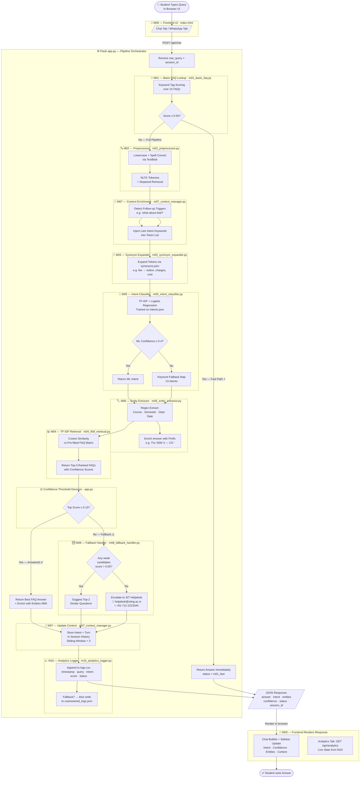
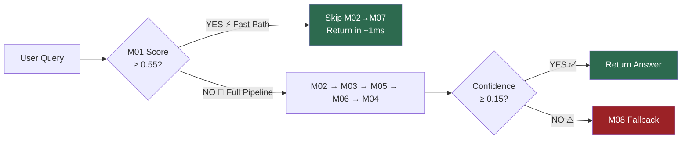
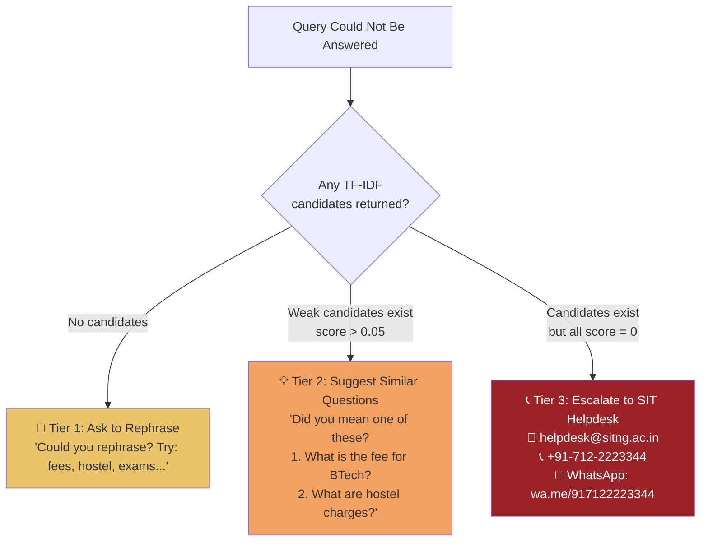
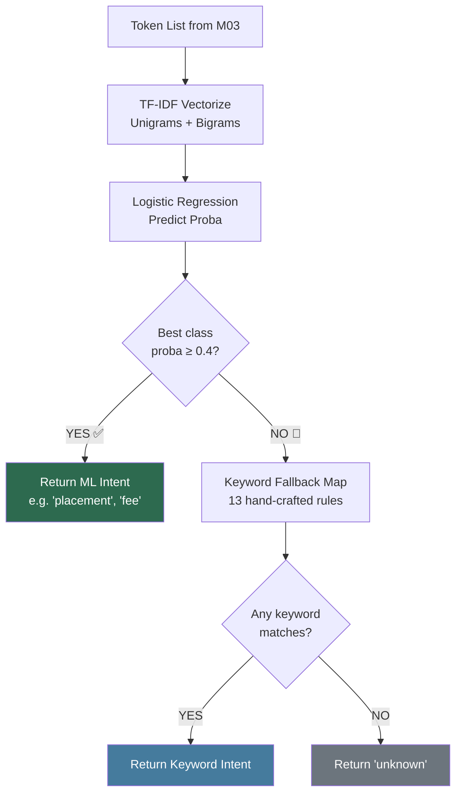
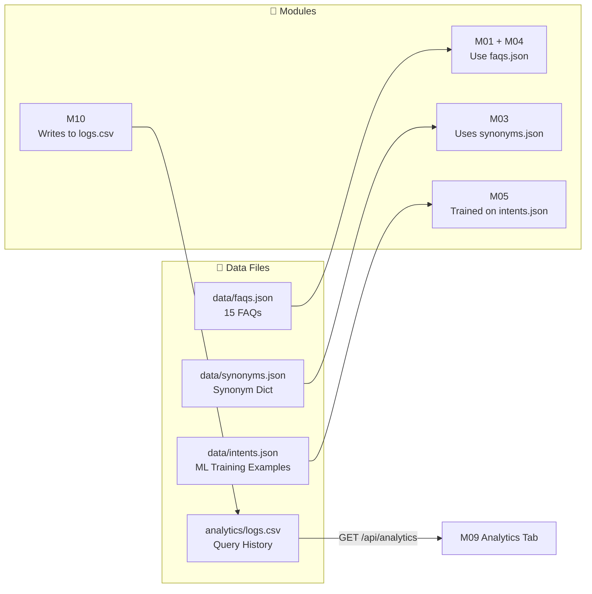

# 🎓 SIT EduBot — Project Flowchart

## Full NLP Pipeline (M01 → M10)

---

## Fast Path vs Full Pipeline

---

## M08 Three-Tier Fallback

---

## M05 Intent Classification Logic

---

## Data Flow Summary

